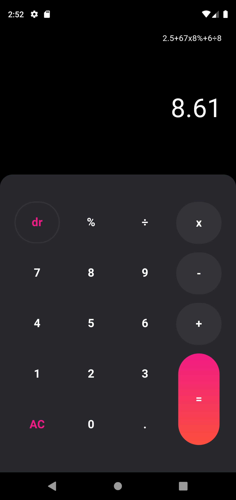
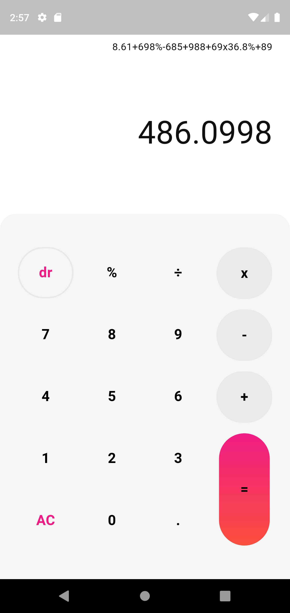

## **📱 Calculator2_0**  
This repository contains a **calculator application** built with **Flutter**. 🛠️  
The project is developed for **Android** but can be modified for **iOS** or any other OS. 🌍  

---

### **🎨 UI Preview**  
<p align="left">
  
  
</p>  

---

### **🚀 Features**  
✅ **Dark / Light Mode** 🌙☀️  
✅ **Responsive UI** 📱  
✅ **Supported Operators:**  
   - ➕ **Addition** ( + )  
   - ➖ **Subtraction** ( - )  
   - ✖ **Multiplication** ( × )  
   - ➗ **Division** ( ÷ )  
   - 🎯 **Percentage** ( % )  

---

### **🛆 Dependencies Used**  
```Dart
dependencies:
  flutter:
    sdk: flutter
  cupertino_icons: ^1.0.8
  provider: ^6.1.2
  math_expressions: ^2.6.0
  flutter_launcher_icons: ^0.14.3
  auto_size_text: ^3.0.0
```

---

### **👅 Installation Guide**  
Follow these steps to set up and run the project:  

1⃣ **Clone the repository**  
```sh
git clone https://github.com/yourusername/Calculator2_0.git
cd Calculator2_0
```
  
2⃣ **Install dependencies**  
```sh
flutter pub get
```

3⃣ **Run the app**  
```sh
flutter run
```

🚨 **Note:** Ensure that you have a connected device or emulator running before executing `flutter run`.

---

### **🌟 Contributing**  
Contributions are **always welcome**! 🎉  
If you’d like to contribute:  

1. **Fork the repository** 🍴  
2. **Create a new branch** (`git checkout -b feature-name`) 🌿  
3. **Make your changes & commit** (`git commit -m "Added feature X"`) 📌  
4. **Push to your branch** (`git push origin feature-name`) 🚀  
5. **Open a Pull Request** ✅  

---

### **📞 Contact & Support**  
📧 **Email:** tanvirahmedananda.cse@email.com  
👖 **Twitter:** [@__Tanvir_Ahmed_](https://x.com/__Tanvir_Ahmed_)  
📘 **LinkedIn:** [Tanvir Ahmed Ananda](https://www.linkedin.com/in/tanvir-ahmed-ananda-1480992b2)  
